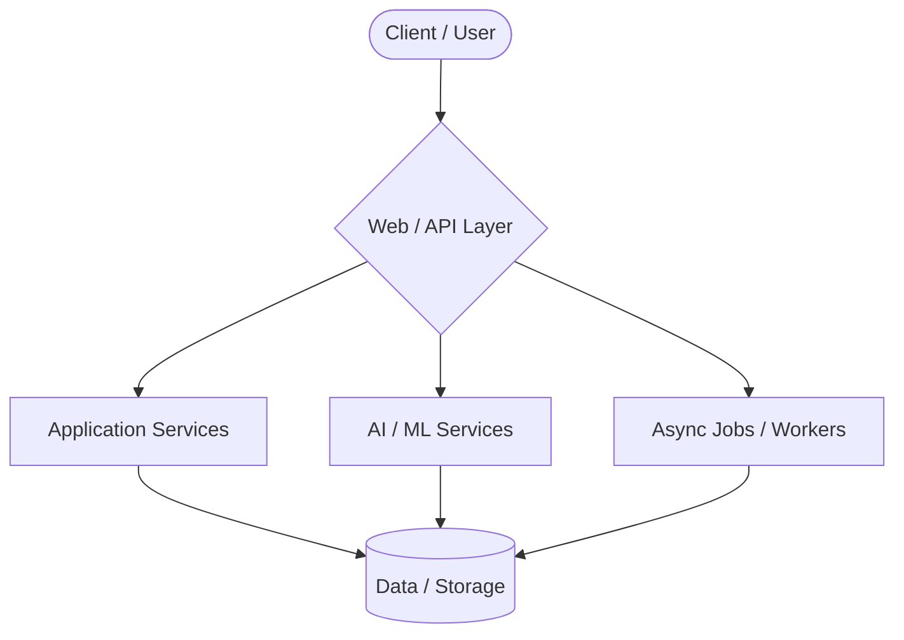

 

 

## 🔭 Engineering Focus

<table width="100%">
  <tr>
    <td width="50%" valign="top">
      <h3>🌐 Full-Stack Engineering</h3>
      <ul>
        <li><b>React & Next.js</b></li>
        <li>Modern web applications</li>
        <li>Responsive interfaces</li>
        <li>Application architecture</li>
      </ul>
    </td>
    <td width="50%" valign="top">
      <h3>⚙️ Backend Systems</h3>
      <ul>
        <li><b>Node.js, Express & Fastify</b></li>
        <li><b>Python, FastAPI & Go</b></li>
        <li>APIs & service boundaries</li>
        <li>Asynchronous processing</li>
      </ul>
    </td>
  </tr>
  <tr>
    <td width="50%" valign="top">
      <h3>🧠 AI & Machine Learning</h3>
      <ul>
        <li><b>Google Gemini & LLMs</b></li>
        <li><b>TensorFlow & Scikit-learn</b></li>
        <li>AI-powered applications</li>
        <li>Intelligent workflows</li>
      </ul>
    </td>
    <td width="50%" valign="top">
      <h3>🏗️ Systems & Architecture</h3>
      <ul>
        <li><b>PostgreSQL, MySQL & Redis</b></li>
        <li><b>Kafka & Event-driven workflows</b></li>
        <li>Distributed job queues</li>
        <li>Reliability & data storage</li>
      </ul>
    </td>
  </tr>
</table>

 

## ⚡ Technology Stack

  

 

## 🚀 Featured Engineering Work

<table width="100%">
  <tr>
    <td width="50%" valign="top">
      <h3><a href="https://github.com/priyanshgupta5101/expenzo">Expenzo</a></h3>
      
Intelligent Expense Management Platform

      
<b>Focus:</b> Real-time APIs · Async Processing · AI-assisted Analysis

      
<b>Tech:</b> Next.js · React · Convex · Gemini · Clerk · Inngest

      <a href="https://github.com/priyanshgupta5101/expenzo">View Repository →</a>
    </td>
    <td width="50%" valign="top">
      <h3><a href="https://github.com/priyanshgupta5101/dermscan-ai">DermScan AI</a></h3>
      
Clinical-Decision Support Platform

      
<b>Focus:</b> Asynchronous Workflows · Event-driven · AI / ML

      
<b>Tech:</b> PHP · Python · FastAPI · TensorFlow · MySQL

      <a href="https://github.com/priyanshgupta5101/dermscan-ai">View Repository →</a>
    </td>
  </tr>
  <tr>
    <td width="50%" valign="top">
      <h3><a href="https://github.com/priyanshgupta5101/distributed-job-queue">Distributed Job Queue</a></h3>
      
Robust distributed job-processing platform

      
<b>Focus:</b> Distributed Processing · Queues · Concurrency · Job Execution

      
<b>Tech:</b> Node.js · Fastify · Redis · PostgreSQL

      <a href="https://github.com/priyanshgupta5101/distributed-job-queue">View Repository →</a>
    </td>
    <td width="50%" valign="top">
      <h3><a href="https://github.com/priyanshgupta5101/event-driven-payment-platform">Event-Driven Payment Platform</a></h3>
      
Event-driven payment and ledger system

      
<b>Focus:</b> Event-driven Architecture · Transactional Outbox · Idempotency

      
<b>Tech:</b> Python · FastAPI · PostgreSQL · Kafka

      <a href="https://github.com/priyanshgupta5101/event-driven-payment-platform">View Repository →</a>
    </td>
  </tr>
  <tr>
    <td width="50%" valign="top">
      <h3><a href="https://github.com/priyanshgupta5101/production-api-gateway">Production API Gateway</a></h3>
      
High-performance distributed API gateway

      
<b>Focus:</b> Request Routing · Circuit Breaking · Rate Limiting · Resilience

      
<b>Tech:</b> Go

      <a href="https://github.com/priyanshgupta5101/production-api-gateway">View Repository →</a>
    </td>
    <td width="50%" valign="top">
      <h3><a href="https://github.com/priyanshgupta5101/AI-Inbox-and-Document-Assisstant">AI Inbox Assistant</a></h3>
      
End-to-end multi-agent email triage workflow

      
<b>Focus:</b> Multi-agent Workflows · AI / ML · RAG Integration

      
<b>Tech:</b> n8n · LangGraph · RAG · MCP

      <a href="https://github.com/priyanshgupta5101/AI-Inbox-and-Document-Assisstant">View Repository →</a>
    </td>
  </tr>
  <tr>
    <td colspan="2" valign="top">
      <h3><a href="https://github.com/priyanshgupta5101/Employees-Attrition">Employee Attrition Prediction</a></h3>
      
Machine learning pipeline for workforce analytics predicting employee attrition.

      
<b>Focus:</b> Machine Learning · MLOps Architecture · Attrition Prediction

      
<b>Tech:</b> Python · Scikit-learn · MLOps

      <a href="https://github.com/priyanshgupta5101/Employees-Attrition">View Repository →</a>
    </td>
  </tr>
</table>

 

## 🏗️ Architecture & Systems

*(A conceptual representation of the scalable, decoupled systems I build and maintain.)*

 

## 📐 Engineering Principles

- **Architecture:** Clear boundaries, modular components, and separation of concerns.
- **Backend:** Reliable APIs, asynchronous workflows, data consistency, and graceful error handling.
- **Application Engineering:** Maintainability, reusable components, robust authentication, and strict validation.
- **AI Systems:** Useful AI integration, structured agent workflows, and application-level intelligence.

 

## 🎯 Current Focus

**01 — Full-Stack Product Engineering** 
Building complete applications from frontend to backend with modern tech stacks.

**02 — Intelligent Applications** 
Integrating AI/ML where it creates tangible and useful product functionality.

**03 — Backend & Distributed Systems** 
Exploring APIs, asynchronous processing, queues, event-driven workflows, and scalable architecture.

 

## 🌐 Connect

  <a href="https://github.com/priyanshgupta5101">GitHub</a> • 
  <a href="mailto:priyanshgupta5101@gmail.com">Email</a>

  

  <i>Building systems. Learning continuously. Shipping thoughtfully.</i>

