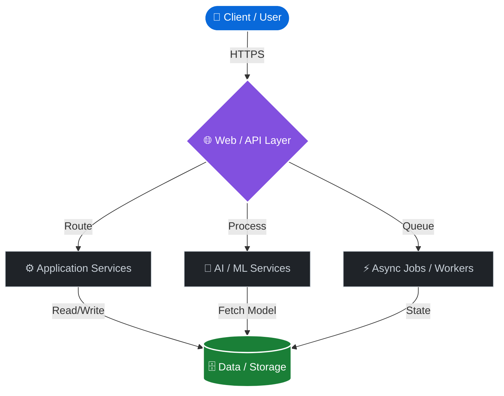

 

 

## 🔭 Engineering Focus

<table>
  <tr>
    <td width="50%" valign="top">
      <h3>🌐 Full-Stack Engineering</h3>
      <blockquote>
        Building complete applications from frontend to backend with modern tech stacks.
      </blockquote>
      
      
      
    </td>
    <td width="50%" valign="top">
      <h3>⚙️ Backend Systems</h3>
      <blockquote>
        Exploring APIs, asynchronous processing, service boundaries, and scalable architecture.
      </blockquote>
      
      
      
      
    </td>
  </tr>
  <tr>
    <td width="50%" valign="top">
      <h3>🧠 AI & Machine Learning</h3>
      <blockquote>
        Integrating AI/ML where it creates tangible and useful product functionality.
      </blockquote>
      
      
      
    </td>
    <td width="50%" valign="top">
      <h3>🏗️ Systems & Architecture</h3>
      <blockquote>
        Designing reliable data storage, event-driven workflows, and distributed job queues.
      </blockquote>
      
      
      
    </td>
  </tr>
</table>

 

## ⚡ Technology Stack

  

 

## 🚀 Featured Engineering Work

<table width="100%">
  <tr>
    <td width="50%" valign="top">
      <h3><a href="https://github.com/priyanshgupta5101/expenzo">💳 Expenzo</a></h3>
      <blockquote>Intelligent Expense Management Platform</blockquote>
      
<b>Focus:</b> Real-time APIs · Async Processing · AI

      
      
      
        
      <a href="https://github.com/priyanshgupta5101/expenzo">View Repository →</a>
    </td>
    <td width="50%" valign="top">
      <h3><a href="https://github.com/priyanshgupta5101/dermscan-ai">🔬 DermScan AI</a></h3>
      <blockquote>Clinical-Decision Support Platform</blockquote>
      
<b>Focus:</b> Async Workflows · Event-driven · AI / ML

      
      
      
        
      <a href="https://github.com/priyanshgupta5101/dermscan-ai">View Repository →</a>
    </td>
  </tr>
  <tr>
    <td width="50%" valign="top">
      <h3><a href="https://github.com/priyanshgupta5101/distributed-job-queue">⚙️ Distributed Job Queue</a></h3>
      <blockquote>Robust distributed job-processing platform</blockquote>
      
<b>Focus:</b> Distributed Processing · Queues · Concurrency

      
      
      
        
      <a href="https://github.com/priyanshgupta5101/distributed-job-queue">View Repository →</a>
    </td>
    <td width="50%" valign="top">
      <h3><a href="https://github.com/priyanshgupta5101/event-driven-payment-platform">💸 Event-Driven Payments</a></h3>
      <blockquote>Event-driven payment and ledger system</blockquote>
      
<b>Focus:</b> Event-driven Architecture · Idempotency

      
      
      
        
      <a href="https://github.com/priyanshgupta5101/event-driven-payment-platform">View Repository →</a>
    </td>
  </tr>
  <tr>
    <td width="50%" valign="top">
      <h3><a href="https://github.com/priyanshgupta5101/production-api-gateway">🚪 Production API Gateway</a></h3>
      <blockquote>High-performance distributed API gateway</blockquote>
      
<b>Focus:</b> Request Routing · Circuit Breaking · Rate Limiting

      
        
      <a href="https://github.com/priyanshgupta5101/production-api-gateway">View Repository →</a>
    </td>
    <td width="50%" valign="top">
      <h3><a href="https://github.com/priyanshgupta5101/AI-Inbox-and-Document-Assisstant">🤖 AI Inbox Assistant</a></h3>
      <blockquote>End-to-end multi-agent email triage workflow</blockquote>
      
<b>Focus:</b> Multi-agent Workflows · AI / ML · RAG

      
      
        
      <a href="https://github.com/priyanshgupta5101/AI-Inbox-and-Document-Assisstant">View Repository →</a>
    </td>
  </tr>
  <tr>
    <td colspan="2" valign="top">
      <h3><a href="https://github.com/priyanshgupta5101/Employees-Attrition">📊 Employee Attrition Prediction</a></h3>
      <blockquote>Machine learning pipeline for workforce analytics predicting employee attrition.</blockquote>
      
<b>Focus:</b> Machine Learning · MLOps Architecture · Attrition Prediction

      
      
        
      <a href="https://github.com/priyanshgupta5101/Employees-Attrition">View Repository →</a>
    </td>
  </tr>
</table>

 

## 🏗️ Architecture & Systems

*(A conceptual representation of the scalable, decoupled systems I build and maintain.)*

 

## 📐 Engineering Principles

- **Architecture:** Clear boundaries, modular components, and separation of concerns.
- **Backend:** Reliable APIs, asynchronous workflows, data consistency, and graceful error handling.
- **Application Engineering:** Maintainability, reusable components, robust authentication, and strict validation.
- **AI Systems:** Useful AI integration, structured agent workflows, and application-level intelligence.

 

## 🎯 Current Focus

**01 — Full-Stack Product Engineering** 
Building complete applications from frontend to backend with modern tech stacks.

**02 — Intelligent Applications** 
Integrating AI/ML where it creates tangible and useful product functionality.

**03 — Backend & Distributed Systems** 
Exploring APIs, asynchronous processing, queues, event-driven workflows, and scalable architecture.

 

## 🌐 Connect

  <a href="https://github.com/priyanshgupta5101">GitHub</a> • 
  <a href="mailto:priyanshgupta5101@gmail.com">Email</a>

  

  <i>Building systems. Learning continuously. Shipping thoughtfully.</i>

